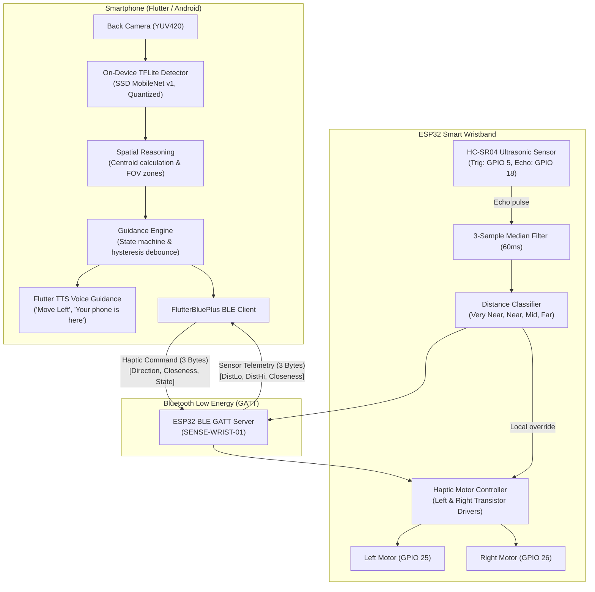

# SENSE System Architecture

SENSE is an assistive object-finding system tailored for blind and low-vision individuals. It pairs real-time, on-device computer vision on a smartphone with a haptic-enabled, BLE-connected smart wristband equipped with ultrasonic proximity sensing.

---

## 1. End-to-End Data Flow

---

## 2. Software Subsystems

### Mobile Application (`mobile/`)
Built with Flutter and Dart for Android (API 23+):
- **`core/constants.dart`**: Protocol enums (`Dir`, `Closeness`, `GState`), BLE UUID constants, distance thresholds, and target mappings.
- **`services/detector_service.dart`**: Camera image stream consumer, integer YUV420 to RGB conversion, rotation mapping for portrait display, interpreter invocation, and 0.5 confidence filtering.
- **`services/guidance.dart`**: Core guidance engine. Manages phases (`searching`, `steer`, `centered`, `near`, `reached`), 400 ms direction hysteresis, 600 ms arrival confirmation, and packet dispatching.
- **`services/ble_service.dart`**: BLE scanner, connection manager, write-without-response sender, and ultrasonic notification listener.
- **`services/speech.dart`**: Text-to-Speech manager for accessible auditory cues.
- **`ui/screens.dart`**: High-contrast accessible UI containing:
  - **Connection Screen**: Device scanner, connection status, motor test buttons, and demo mode switch.
  - **Select Screen**: Target selector for `PHONE`, `BOTTLE`, and `CUP`.
  - **Finding Screen**: Camera viewfinder with bounding-box overlay, large high-contrast instruction text, distance readout, simulated fallback controls, and diagnostic telemetry drawer.

### Firmware Subsystem (`firmware/sense_wrist/`)
Arduino/C++ for ESP32:
- **BLE GATT Server**: Advertises as `SENSE-WRIST-01` with standard 128-bit custom service and characteristic UUIDs.
- **HC-SR04 Driver**: Non-blocking 60 ms sampling trigger with a 25 ms timeout and a 3-sample median filter to reject ultrasonic multipath noise.
- **Haptic Pulse Generator**: Time-sliced pulsing engine (`ON_MS = 80ms`) modulated across distance classes (160 ms to 900 ms period).
- **Hardware Failsafe**: Automatic motor cut-off if no BLE packet is received within 1500 ms.
- **Boot Self-Test**: Haptic verification sequence (left motor buzz, pause, right motor buzz) upon power-up.

---

## 3. Guiding Architectural Principles

1. **Zero Cloud Dependency**: Operates entirely offline. No APIs, no remote servers, no cloud inference latency, and no data tracking.
2. **Deterministic Latency**: Local TFLite inference (~50 ms) and BLE write-without-response (~15 ms) ensure near-instant haptic feedback.
3. **Dual Confirmation for Object Arrival**: Object reached state requires both:
   - Target visually centered in the camera view (`0.35 <= normalizedX <= 0.65`).
   - Ultrasonic proximity confirmed $< 60\text{ cm}$ held for $\ge 600\text{ ms}$.
4. **Graceful Degradation**: If camera permission is denied or physical hardware is unavailable, the application immediately drops back to an interactive simulated test mode.
