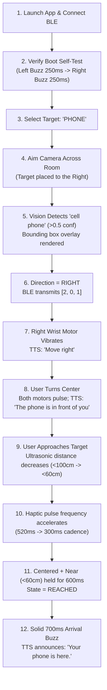

# SENSE Live Demonstration Script

This document details the step-by-step procedure for demonstrating the SENSE assistive object-finding system during live hackathon presentations and evaluations.

---

## 1. Demo Prerequisites

- **Hardware Mode**:
  - ESP32 Smart Wristband powered via USB/LiPo battery.
  - Android smartphone with SENSE mobile app installed (`mobile/`).
  - Target object (e.g., a smartphone, bottle, or cup) placed on a table 1.5–2 meters away.
- **Simulation / Offline Demo Mode**:
  - Android phone running in **Demo Mode** (no wristband or camera hardware required; fully testable via screen controls and simulated distance slider).

---

## 2. Live Demo Workflow

---

## 3. Step-by-Step Presentation Walkthrough

### Step 1: Power On & Connection
1. Power the ESP32 wristband.
2. Observe the tactile **Boot Self-Test**: Left motor pulses (250 ms), then Right motor pulses (250 ms).
3. On the phone, tap **Connect**. The app discovers `SENSE-WRIST-01` and connects over BLE.
4. Tap **Test Motors** on screen to show live bidirectional command execution.

### Step 2: Target Selection
1. Tap the **PHONE** card on the target selection screen.
2. The phone announces via TTS: *"Looking for phone."*

### Step 3: Directional Guidance
1. Hold the phone in portrait orientation.
2. Aim the camera so the target phone is on the **right** side of the camera viewfinder.
3. The on-device TFLite model detects the phone with $>0.5$ confidence; a bounding box appears.
4. The app calculates $\text{normalizedX} > 0.65$, transmits `Dir.right` over BLE, and speaks: *"Move right."*
5. The **right vibration motor** pulses on the user's wrist.

### Step 4: Centering the Target
1. Pan the camera toward the center until the bounding box falls within $0.35 \le x \le 0.65$.
2. Both wrist motors pulse synchronously. The phone announces: *"The phone is in front of you."*

### Step 5: Distance Scaling & Approach
1. Walk forward toward the phone with the wristband facing the target.
2. As the ultrasonic distance decreases:
   - At $\ge 100\text{ cm}$ (`FAR`): Slow pulses (900 ms period).
   - At $< 100\text{ cm}$ (`MID`): Medium pulses (520 ms period).
   - At $< 60\text{ cm}$ (`NEAR`): Rapid pulses (300 ms period). TTS announces: *"You're close."*

### Step 6: Confirmation of Arrival
1. Bring the hand within $60\text{ cm}$ while centered for $\approx 600\text{ ms}$.
2. Both wrist motors deliver an uninterrupted, solid **700 ms arrival buzz**.
3. The phone's voice announces: **"Your phone is here."**
4. UI displays high-contrast green banner: **FOUND**.

---

## 4. Backup Demo Mode (No Hardware Required)

If evaluating without the ESP32 hardware or camera permissions:
1. On the connection screen, enable the **"Demo Mode"** switch.
2. Tap **Simulate Finding**.
3. Use the directional buttons (`Left`, `Center`, `Right`) to simulate AI vision input.
4. Drag the **Distance Slider** from $150\text{ cm}$ down to $20\text{ cm}$.
5. Observe the live state transitions (`SEARCHING` $\rightarrow$ `APPROACHING` $\rightarrow$ `REACHED`), TTS audio announcements, and 3-byte packet diagnostics in the expandable telemetry drawer.
